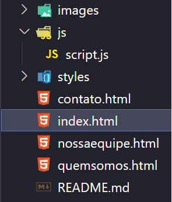
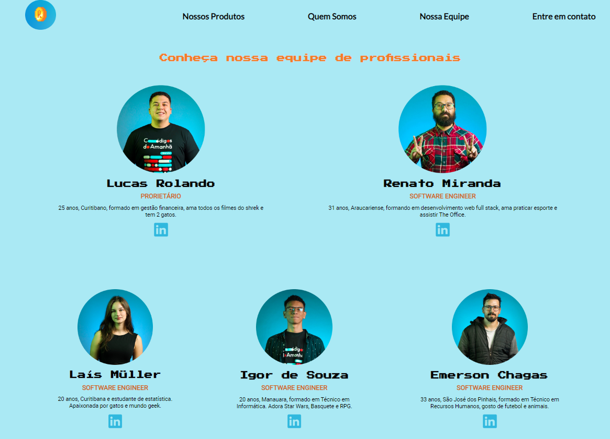

# Ajude um Empreendedor - Site Rolando Games 💻🎮

Este é o repositório do projeto do site do e-commerce de games chamado Rolando Games. O objetivo desse projeto foi criar uma loja online para venda de jogos, atendendo aos requisitos solicitados. O site está em fase inicial de desenvolvimento e foi criado como parte da formação em front-end utilizando HTML, CSS e JavaScript.

  

 
 
O projeto precisava seguir os seguintes requisitos:

## Requisitos
- O projeto deve usar uma estrutura de pastas separadas para os arquivos de CSS,
JS e as imagens (os arquivos HTML podem ficar na raiz do projeto);

- O site deve conter 4 páginas: “quem somos”, “nossos produtos/serviços”, “nossa
equipe” e uma página de “formulário de contato”;

-  A página de formulário de contato deve utilizar Javascript para validar as
informações que são preenchidas, e mostrar uma mensagem se estão ok para
enviar ou não.

- A página de produtos/serviços precisa ter alguma interação utilizando Javascript
também. Pode ser uma simulação de orçamento, de carrinho de compra, interação
com itens, etc. O grupo fica livre para decidir que tipo de interação vai agregar ao
projeto.

- O projeto precisa possuir uma evidência de entrega, ou seja, um pequeno
parágrafo com uma explicação do que foi feito no projeto e a defesa das
escolhas que o grupo tomou, usando o arquivo README.md no GitHub.

- Disponibilização do projeto em um repositório no GitHub e utilização do GitHub Pages para acesso direto ao projeto.

## Estrutura do Projeto
- **styles**: Pasta contendo o arquivo CSS utilizados no projeto.
- **js**: Pasta contendo o arquivo JavaScript utilizados no projeto.
- **images**: Pasta para armazenar as imagens utilizadas no site.
- **index.html**: Arquivo HTML da página inicial "Nossos Produtos".
- **quemsomos.html**: Arquivo HTML da página "Quem Somos".
- **nossaequipe.html**: Arquivo HTML da página "Nossa Equipe".
- **contato.html**: Arquivo HTML da página "Formulário de Contato".
- **README.md**: Este arquivo, contendo informações sobre o projeto.

  

## Descrição do Projeto
O site do Rolando Games é um e-commerce de games que está iniciando suas atividades. Possui 4 páginas principais:

- **Quem Somos**: Nesta página, apresentamos uma descrição sobre a empresa, sua história e missão.
- **Nossos Produtos**: Aqui são exibidos os produtos e serviços oferecidos pela loja, com informações, imagens e preços. Implementamos um slider automático para destacar os principais produtos.
- **Nossa Equipe**: Apresentamos os membros da equipe do Rolando Games, com suas respectivas fotos e informações profissionais.
- **Formulário de Contato**: Os visitantes podem preencher um formulário de contato para enviar mensagens à equipe. Utilizamos JavaScript para validar as informações inseridas e exibir uma mensagem indicando se o formulário está pronto para envio ou não.

## Evidência de Entrega

Neste projeto do Rolando Games, conseguimos atender a todos os requisitos solicitados. Seguem as evidências:

- Utilizamos uma estrutura de pastas separadas para organizar os arquivos de CSS, JS e imagens.
- Criamos as 4 páginas principais conforme especificado: "Quem Somos", "Nossos Produtos", "Nossa Equipe" e "Contato".
- Implementamos a validação do formulário de contato utilizando JavaScript.
- Adicionamos interatividade na página de produtos com um slider automático.
- Disponibilizamos o projeto em um repositório no GitHub, permitindo fácil acesso e colaboração.

Fique à vontade para explorar o código, sugerir melhorias ou entrar em contato para qualquer esclarecimento adicional.

Agradecemos a oportunidade de desenvolver o projeto do Rolando Games e esperamos que apreciem o resultado final.

Atenciosamente,
Squad 3 - Códigos do Amanhã EBANX 2023.

Lucas Rolando
Emerson Chagas
Igor Pinto
Renato Miranda
Laís Müller

